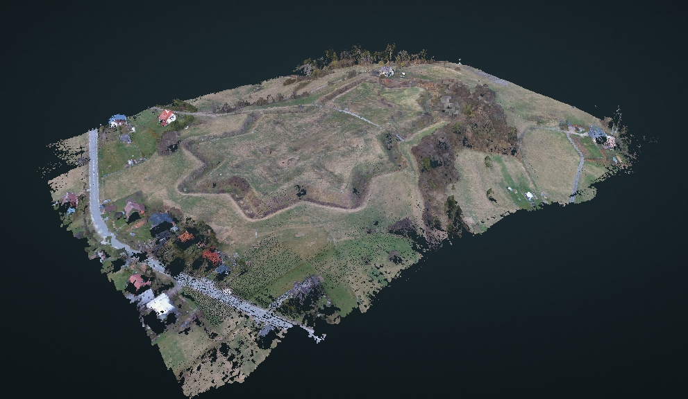

# Jablunkovske sance dataset

Dataset made with DJI Phantom 3 Standard, from 70m altitude in Jablunkov Pass, on historical site of XVII century fortifications.

## Localisation

https://opentopomap.org/#map=16/49.49789/18.74768

## History

In Polish: https://pl.wikipedia.org/wiki/Sza%C5%84ce_jab%C5%82onkowskie
